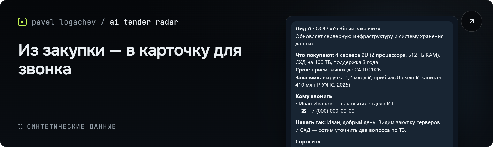
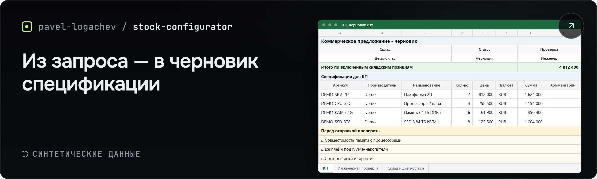
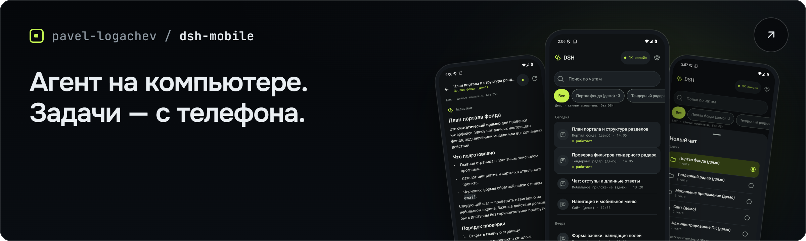
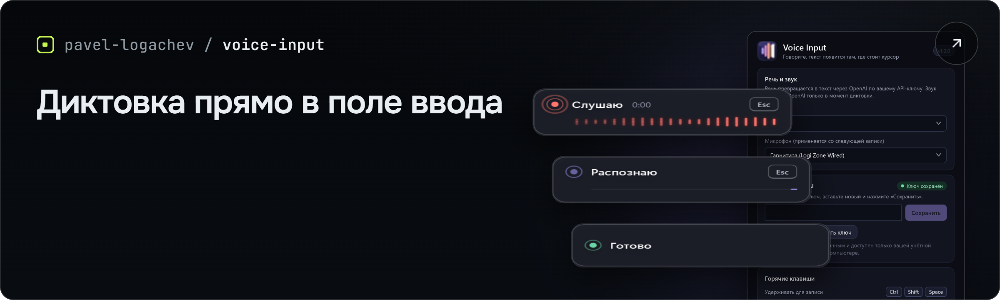
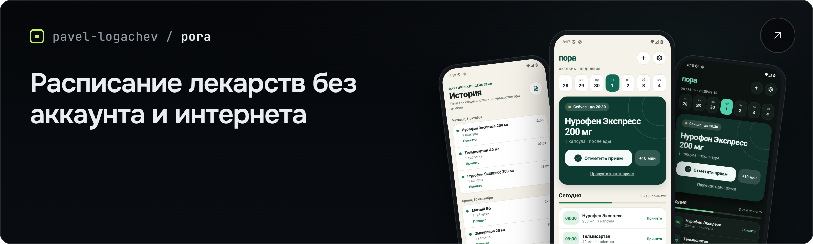

<a href="https://logachev.net/"><picture><source media="(max-width: 767px)" srcset="assets/profile-banner-mobile.png"></picture></a>

[Сайт](https://logachev.net/) · [Журнал](https://logachev.net/journal/) · [Telegram-канал](https://t.me/logachev_ai) · [Обсудить задачу](mailto:ai@logachev.net)

Я Павел Логачев — внедряю ИИ-агентов в работу команд продаж, закупок, пресейла и ИТ: сам разбираю процесс, собираю и запускаю систему.

20 лет работаю в ИТ: первые 10 — инженером, следующие 10 — руководителем крупных проектов системной интеграции. С ИИ-агентами интенсивно работаю около полугода — больше 1000 часов практики.

Здесь можно проверить, как устроены мои проекты: изучить код, тесты и ограничения, скачать приложения.

## Проекты для бизнеса

### AI Tender Radar

<a href="https://github.com/pavel-logachev/ai-tender-radar"><picture><source media="(max-width: 767px)" srcset="assets/card-ai-tender-radar-mobile.png"></picture></a>

Я сделал радар для поиска заказчиков по закупкам серверов и систем хранения данных на Bidzaar. Агент читает документы и отчётность ФНС, ищет контакт и готовит карточку в Telegram: что покупают, кому звонить и о чём говорить. Код сверяет телефон с прочитанным источником, но его актуальность выясняется при звонке — связывается с заказчиком менеджер.

**Результат:** на одном наборе из 16 закупок агент нашёл человека с проверенным телефоном в 8–9 случаях, в зависимости от модели; прежняя цепочка кода — в 3. Это один рабочий прогон, сам набор не опубликован.

**Стек:** Python · SQLite · Telegram · Excel

[Исходный код](https://github.com/pavel-logachev/ai-tender-radar) · [Разбор проекта](https://logachev.net/journal/ii-agent-dlya-generacii-lidov-zakupki/)

### Stock Configurator

<a href="https://github.com/pavel-logachev/stock-configurator"><picture><source media="(max-width: 767px)" srcset="assets/card-stock-configurator-mobile.png"></picture></a>

Я сделал конфигуратор для пресейла: запрос в Telegram превращается в черновик серверной спецификации по данным склада дистрибьютора. Модель выбирает оборудование, код подставляет артикулы, цены и остатки и пересчитывает суммы. Состав, совместимость и условия поставки проверяет инженер.

**Результат:** Excel: первый лист «КП» содержит черновик коммерческого предложения и блок «Перед отправкой проверить». Это первая рабочая версия; экономия времени пока не измерялась.

**Стек:** Python · FastAPI · PostgreSQL · Telegram · Excel

[Исходный код](https://github.com/pavel-logachev/stock-configurator) · [Разбор проекта](https://logachev.net/journal/podbor-oborudovaniya-po-skladu-ii/)

В [статье об AI Proposal Builder](https://logachev.net/journal/kommercheskoe-predlozhenie-ii/) показываю, как из сообщения в Telegram собирается коммерческое предложение в DOCX и PDF для проверки менеджером; код проекта закрыт.

## Приложения, которые можно установить

### [DSH Mobile](https://github.com/pavel-logachev/dsh-mobile)

<a href="https://github.com/pavel-logachev/dsh-mobile"><picture><source media="(max-width: 767px)" srcset="assets/card-dsh-mobile-mobile.png"></picture></a>

Сделал неофициальный Android-клиент для DeepSeek Harness: с телефона можно открыть чат, поставить задачу и следить за ответом агента. Подключение — по Wi-Fi или через Tailscale; агент работает на компьютере, поэтому компьютер и DSH должны быть включены.

**Платформа и стек:** Android 8+ · Kotlin · Jetpack Compose · Node.js

[Скачать 0.5.0](https://github.com/pavel-logachev/dsh-mobile/releases/tag/v0.5.0)

### [Voice Input](https://github.com/pavel-logachev/voice-input)

<a href="https://github.com/pavel-logachev/voice-input"><picture><source media="(max-width: 767px)" srcset="assets/card-voice-input-mobile.png"></picture></a>

Сделал диктовку для полей ввода Windows: зажмите горячую клавишу, произнесите текст и отпустите — он появится у курсора. Для распознавания нужны интернет и ваш API-ключ OpenAI; запросы оплачиваются с вашего аккаунта.

**Платформа и стек:** Windows 10 1809+ / 11 x64 · .NET 10 · WPF

[Скачать 1.0.0](https://github.com/pavel-logachev/voice-input/releases/tag/v1.0.0)

### [Пора](https://github.com/pavel-logachev/pora)

<a href="https://github.com/pavel-logachev/pora"><picture><source media="(max-width: 767px)" srcset="assets/card-pora-mobile.png"></picture></a>

В «Поре» я собрал расписание лекарств, напоминания и историю приёма, которые работают без аккаунта и интернета. Встроенный справочник ЕСКЛП содержит 23 001 препарат; приложение не назначает лечение и не проверяет совместимость лекарств.

**Платформа и стек:** Android 7+ · React Native · Expo · SQLite

[Скачать 1.1.0](https://github.com/pavel-logachev/pora/releases/tag/v1.1.0)

## Начнём с одного процесса

- Начинаю с одного процесса. Если обычный код или готовый сервис справятся надёжнее, скажу об этом.
- До подключения к данным вместе с вашей командой заполняю паспорт агента: что он читает и готовит, как код ограничивает доступ и проверяет результат, что решает человек.
- Стоимость и срок первой версии называю после разбора задачи, до начала работы.
- Проверяю первую версию на ваших данных вместе с командой. До проверки не обещаю экономию в цифрах.
- **Опишите один рабочий процесс** [в Telegram](https://t.me/pavel_logachev) или [письмом](mailto:ai@logachev.net): как он устроен, что мешает и какой результат нужен. Для первого разговора конфиденциальные данные не нужны.

---

В публичных репозиториях — код и релизы; данные клиентов и закрытые рабочие системы я не публикую.

Москва. Работаю с клиентами по всей России и в странах СНГ.

[ai@logachev.net](mailto:ai@logachev.net) · [Telegram: @pavel_logachev](https://t.me/pavel_logachev) · [logachev.net](https://logachev.net/)
