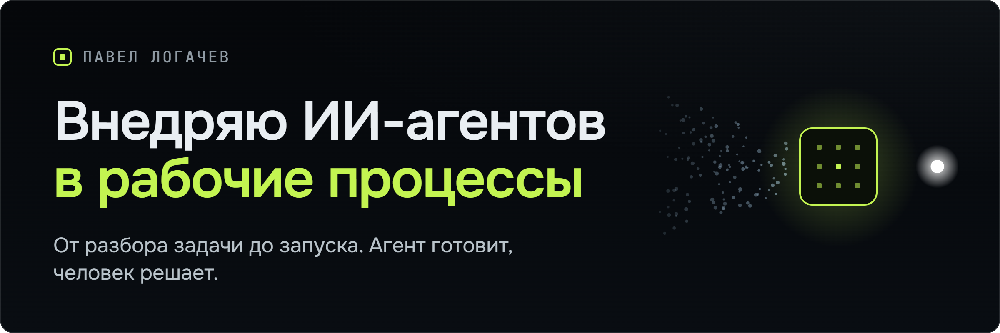

<!-- github-profile-readme -->

  

  <a href="https://logachev.net/">Сайт</a>
  &nbsp;·&nbsp;
  <a href="https://logachev.net/portfolio/tender-radar/">AI Tender Radar</a>
  &nbsp;·&nbsp;
  <a href="https://logachev.net/portfolio/stock-configurator/">Stock Configurator</a>
  &nbsp;·&nbsp;
  <a href="https://t.me/logachev_ai">Telegram-канал</a>
  &nbsp;·&nbsp;
  <a href="https://habr.com/ru/users/pavel-logachev/">Habr</a>
  &nbsp;·&nbsp;
  <a href="mailto:ai@logachev.net?subject=%D0%A5%D0%BE%D1%87%D1%83%20%D0%BE%D0%B1%D1%81%D1%83%D0%B4%D0%B8%D1%82%D1%8C%20%D0%B7%D0%B0%D0%B4%D0%B0%D1%87%D1%83">Написать</a>

**Внедряю ИИ-агентов под задачи бизнеса.** В любой компании есть процессы, которые съедают время команды: заявки, расчёты, документы, отчёты, переписка. Агент берёт такую рутину на себя, а человек принимает решение. Модель занимается смыслом, код отвечает за интеграции, проверки, безопасность и воспроизводимость.

## Проекты

<table>
  <tr>
    <td width="50%" valign="top">
      <h3><a href="https://github.com/pavel-logachev/ai-tender-radar">AI Tender Radar</a></h3>
      
Разведка по закупкам: ограниченный сбор документов и LLM-разбор с опорой на доказательства превращают поток тендеров в очередь лидов, которую проверяет человек.

      
<strong>Проверить:</strong> публичная clean-room версия · 767 тестов · агентный контур · Telegram и Excel

      
<a href="https://logachev.net/portfolio/tender-radar/">Кейс →</a>

    </td>
    <td width="50%" valign="top">
      <h3><a href="https://github.com/pavel-logachev/stock-configurator">Stock Configurator</a></h3>
      
MVP для presales в инфраструктурных продажах: свободный запрос и складские остатки дистрибьютора превращаются в черновик спецификации с явными допущениями.

      
<strong>Стек:</strong> Telegram · FastAPI · PostgreSQL · Excel · детерминированная сверка

      
<a href="https://logachev.net/portfolio/stock-configurator/">Кейс →</a>

    </td>
  </tr>
  <tr>
    <td width="50%" valign="top">
      <h3><a href="https://github.com/pavel-logachev/voice-input">Voice Input</a></h3>
      
Диктовка для Windows в трее: удерживайте горячую клавишу, говорите, и текст появится в активном поле ввода. Распознаёт OpenAI по вашему API-ключу, ключ хранится зашифрованным.

      
<strong>Стек:</strong> .NET 10 · WPF · WASAPI · OpenAI · 146 тестов

      
<a href="https://github.com/pavel-logachev/voice-input/releases/latest">Релиз 1.0.0 →</a>

    </td>
    <td width="50%" valign="top">
      <h3><a href="https://github.com/pavel-logachev/pora">Пора</a></h3>
      
Local-first Android-приложение для расписания лекарств: точные напоминания, история приёмов, необязательная синхронизация.

      
<strong>Проверить:</strong> подписанный APK 1.0.2 · Android 7+ · проверено в реальном использовании

      
<a href="https://logachev.net/portfolio/pora/">Кейс →</a> · <a href="https://github.com/pavel-logachev/pora/releases/latest">Релиз →</a>

    </td>
  </tr>
</table>

И ещё: <a href="https://github.com/pavel-logachev/portable-agent-os"><strong>Portable Agent OS</strong></a> — обратимый слой управления для Codex, Aider и локальных агентных процессов, открытый код под Apache-2.0.

## Как я работаю

1. **Понять** реальный процесс.
2. **Собрать** один законченный сценарий от начала до конца.
3. **Проверить** отказы и реальное окружение.
4. **Выпустить** с документацией и честными ограничениями.

Первую версию держу небольшой. Тесты, установка или развёртывание, диагностика и документация входят в продукт. Бэкграунд: B2B IT и системная интеграция.

В публичных репозиториях лежат самостоятельные продукты и открытые системы. Данные клиентов и закрытые рабочие системы не публикуются.

  Москва · русский / English · <a href="https://logachev.net/">logachev.net</a> · <a href="https://t.me/pavel_logachev">@pavel_logachev</a> · <a href="https://t.me/logachev_ai">канал</a> · <a href="https://habr.com/ru/users/pavel-logachev/">Habr</a>

---

## English

I implement AI agents for business workflows. The agent prepares, the human decides: the model handles semantic work, while code owns integrations, validation, security and reproducibility. My background is B2B IT and systems integration; my product work spans local-first applications, internal tools and practical AI automation.

- **[AI Tender Radar](https://github.com/pavel-logachev/ai-tender-radar)** — procurement intelligence with bounded document acquisition and evidence-first LLM triage; public clean-room edition with the agent-first core, 767 tests.
- **[Stock Configurator](https://github.com/pavel-logachev/stock-configurator)** — infrastructure-presales MVP that turns free-form requests and distributor stock into reviewable draft specifications.
- **[Voice Input](https://github.com/pavel-logachev/voice-input)** — Windows tray dictation: hold a hotkey, speak, and the text appears in the active field (OpenAI recognition with your own API key).
- **[Pora](https://github.com/pavel-logachev/pora)** — local-first Android medication reminders with exact alarms and history.
- **[Portable Agent OS](https://github.com/pavel-logachev/portable-agent-os)** — reversible, capability-aware control layer for local AI-agent workflows.

Contact: [ai@logachev.net](mailto:ai@logachev.net) · [Telegram](https://t.me/pavel_logachev) · [logachev.net](https://logachev.net/)
